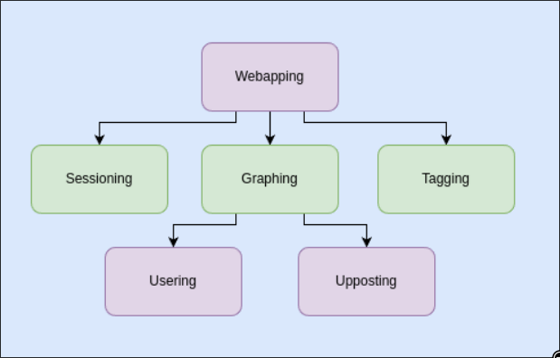
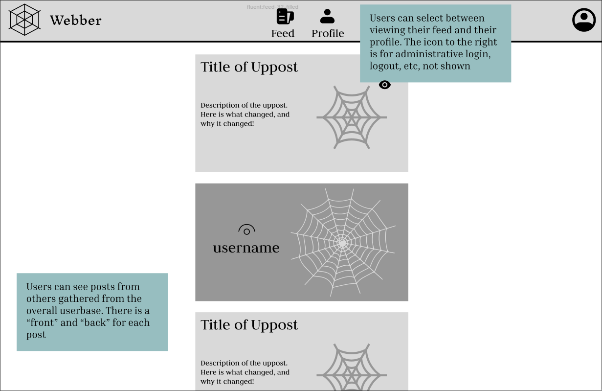

# Webber

## Introduction

Every day, there seems to be a new social media app or website that everyone is using - BeReal for sharing your daily life, Beli for sharing your favorite restaurants, Lemon8 as a new cross between Pinterest and Instagram, and countless others. Even if not social media, everyone has a particular way that they use the internet. It can often become dizzying to keep up with all the new technologies, let alone your own usage of the internet.

Webber strives not just to be another application on the internet, but rather to be a **meta** application that helps you track and share how you use the internet. Webber allows you to connect and visualize all the websites and apps you use, creating insights into how you use the technology. Through a creative graph-like interface, you will be able to see common trends and linkages within your internet usage, and optionally share and compare with friends.

Webber wants to actively help your usage of the internet - whether that's having a deeper understanding of your habits or finding great alternatives to common usage patterns, Webber will help you navigate the digital world. If you are someone who wants to piece together and organize your online footprint, Webber is the app for you.

## Concepts

Blue boxes represent concepts that are specific to my application and represent some sort of unique functionality. Grayed boxes represent important but frequently used and well tested concepts among other social media platforms, although still specialized for Webber. For example, one interesting case of this is the Usering concept, which is generally relatively similar across most social media applications, but in the creation of Webber I have a notion of Users also owning some sort of data, which becomes an integral part of the dependency tree. To explain what a user is, you must explain the data that they store.

:::tip Webapping
**Purpose**: Store metadata about websites and apps that the user visits such as the name and purpose.

**Principle**: When a user wants to add a website or app, they can do so by creating a new Webapp instance

**State**:
```typescript
name: one String
purpose: one String
tags: set String
```

**Actions**:
```typescript
makeWebapp(n: String, p: String, out w: Webapp):
    w.name := n
    w.purpose := p
setName(n: String):
    name := n
setPurpose(p: String):
    purpose := p
```
:::

:::tip Graphing [Item]
**Purpose**: Represent the connections of items to each other

**Principle**: When a user wants to connect an Item to already existing items, they can do so by adding it to the graph. The graph allows users to model and visualize the relationships between items

**State**:
```typescript
nodes: set Item
neighbors: nodes -> set Item
```

**Actions**: 
```typescript
addNode(g: Graph, i: Item):
    i not in nodes
    nodes += i
addEdge(g: Graph, i1: Item, i2: Item):
    i1 in nodes && i2 in nodes
    i1.neighbors += i2
    i2.neighbors += i1
removeEdge(g: Graph, i1: Item, i2: Item):
    i1 in nodes && i2 in nodes
    i1.neighbors -= i2
    i2.neighbors -= i1
getNeighbors(g: Graph, i: Item, out n: set Item):
    i in nodes
    n := i.neighbors
getNodes(g: Graph, out n: set Item):
    n := nodes
```
:::

:::tip Tagging [Item]
**Purpose**: Label and add metadata about items

**Principle**: When users want to convey additional information about a item, they can do so by adding tags to the item. Tags can be used to sort, filter, and search for items

**State**:
```typescript
items: set Item
tags: items -> set String
```

**Actions**:
```typescript
addItem(i: Item):
    i not in items
    items += i
removeItem(i: Item):
    i in items
    items -= i
addTag(i: Item, t: String):
    i in items
    t not in i.tags
    i.tags += t
removeTag(i: Item, t: String):
    i in items
    t in i.tags
    i.tags -= t
getTags(i: Item, out t: set String):
    i in items
    t := i.tags
getItemsWithTag(t: String, out i: set Item):
    i := tags.t
checkItemsShareTags(i1: Item, i2: Item, out n: Integer):
    i1 in items && i2 in items
    n := len((i1.tags).(i2.tags))
```
:::

:::tip Upposting [Item]
**Purpose**: A combination of updating and posting, upposting allows users to take an item and share updates with others through post-like functionality

**Principle**: When a user wants to share an update to an item, they uppost the item. A history of updates is kept for each item

**State**:
```typescript
items: set Item
itemHistory: items -> one timeline

timeline: set Item
uppostTitle: timeline -> one String
uppostContent: timeline -> one String
```

**Actions**:
```typescript
addItem(i: Item):
    i not in items
    items += i
removeItem(i: Item):
    i in items
    items -= i
uppost(old: Item, new: Item, title: String, content: String):
    old in items
    timeline := old.itemHistory
    del old.itemHistory
    new.itemHistory := timeline
    new.timeline += (title, content)
getTimelineAsString(i: Item, out t: set (String, String)):
    i in items
    t := i.timeline
```
:::

:::info Usering [Data]
**Purpose**: Manage users and provide a method of authentication and authorization. Users can also own data

**Principle**: After a user registers with a username and password, they can login by authenticating using the same credentials.

**State**:
```typescript
registeredUsers: set User
username: registerUser -> one String
password: registerUser -> one String
data: registeredUsers -> one Data
```

**Actions**:
```typescript
register(n: String, p: String, out u: User):
    u not in registeredUsers
    u.username := n
    u.password := p
    registeredUsers += u
login(n: String, p: String, out u: User):
    u in registeredUsers
    u.username == n && u.password == p
getData(u: User, out d: Data):
    u in registeredUsers
    d := u.data
getUsers(out u: set User):
    u := registeredUsers
```
:::

:::info Sessioning [User]
**Purpose**: Allow authenticated user to exist for a period

**Principle**: When a user logs in, they are given a session that lasts them until they log out

**State**:
```typescript
sessions: set Session
user: active -> one User
```

**Actions**:
```typescript
beginSession(u: User, out s: Session):
    s not in sessions
    s.user := u
    sessions += s
getSessionUser(s: Session, out u: User):
    s in sessions
    u := s.user
endSession(s: Session):
    s in sessions
    sessions -= s
```
:::


## App and Synchronizations

```typescript
app Webber:
    include Webapping
    include Graphing[Webapp]
    include Usering[Graphing]
    include Tagging[Webapp]
    include Upposting[Graph]
    include Sessioning[User]

    sync register(u: username, p: password, out user: User):
        Usering.register(u, p, user)

    sync login(u: username, p: password, out session: Session):
        when Usering.login(u, p, user):
            Sessioning.beginSession(user, session)

    sync logout(s: Session):
        Sessioning.endSession(s)

    sync addWebapp(s: Session, name: String, purpose: String, tags: set String):
        when Sessioning.getSessionUser(s, user):
            Usering.getData(user, oldData)
            data := copy(oldData)
            Webapping.makeWebapp(name, purpose, webapp)
            Graphing.addNode(data, webapp)
            Tagging.addItem(webapp)
            for tag in tags:
                Tagging.addTag(webapp, tag)
            for neighbor in Graphing.getNeighbors(data, webapp):
                if Tagging.checkItemsShareTags(webapp, neighbor) > 0:
                    Graphing.addEdge(data, webapp, neighbor)
                    Upposting.uppost(
                        neighbor,
                        webapp,
                        "New Connection",
                        "New connection between " + neighbor.name + " and " + webapp.name
                    )
            Upposting.addItem(Graph)

    sync updateWebapp(s: Session, webapp: Webapp, name: String, purpose: String):
        when Sessioning.getSessionUser(s, user):
            Usering.getData(user, data)
            Webapping.setName(webapp, name)
            Webapping.setPurpose(webapp, purpose)
            Upposting.uppost(
                webapp,
                webapp,
                "Webapp Updated",
                "Webapp " + webapp.name + " updated with new name and purpose"
            )

    sync removeWebapp(s: Session, webapp: Webapp):
        when Sessioning.getSessionUser(s, user):
            Usering.getData(user, oldData)
            Tagging.removeItem(webapp)
            data := copy(oldData)
            Graphing.removeNode(data, webapp)
            for neighbor in Graphing.getNeighbors(data, webapp):
                Graphing.removeEdge(data, webapp, neighbor)
                Upposting.uppost(
                    neighbor,
                    webapp,
                    "Connection Removed",
                    "Connection removed between " + neighbor.name + " and " + webapp.name
                )
            Upposting.removeItem(Graph)

    sync addTagToWebapp(
        s: Session,
        webapp: Webapp,
        tag: String,
        uppostTitle: String,
        uppostContent: String
    ):
        when Sessioning.getSessionUser(s, user):
            // add tag to the webapp which should be a reference to our graph
            Usering.getData(user, oldData)
            Tagging.addTag(webapp, tag)
            // post change
            Usering.getData(user, data)
            Upposting.uppost(oldData, data, uppostTitle, uppostContent)


    sync removeTagFromWebapp(
        s: Session,
        webapp: Webapp,
        tag: String,
        uppostTitle: String,
        uppostContent: String
     ):
        when Sessioning.getSessionUser(s, user):
            Usering.getData(user, oldData)
            Tagging.removeTag(webapp, tag)
            Usering.getData(user, data)
            Upposting.uppost(oldData, data, uppostTitle, uppostContent)

    sync filterWebappsByTag(tag: String, out webapps: set Webapp):
        Tagging.getItemsWithTag(tag, webapps)

    sync userTopTags(s: Session, out tags: set String):
        when Sessioning.getSessionUser(s, user):
            Usering.getData(user, data)
            Graphing.getNodes(data, nodes)
            for node in nodes:
                Tagging.getTags(node, nodeTags)

                tags := aggregate and return most frequently tags

    sync userTopWebapps(s: Session, out webapps: set Webapp):
        when Sessioning.getSessionUser(s, user):
            Usering.getData(user, data)
            Graphing.getNodes(data, webapps)
            webapps := aggregate and return most frequently webapps

    sync userTopWebappsForTag(s: Session, tag: String, out webapps: set Webapp):
        when Sessioning.getSessionUser(s, user):
            Usering.getData(user, data)
            Tagging.getItemsWithTag(tag, items)
            for item in items:
                Graphing.getNeighbors(data, item, neighbors)
                webapps := aggregate and return most frequently webapps with this given tag

    system sync showPostsForUser(s: Session, out posts: set (String, String)):
        when Sessioning.getSessionUser(s, user):
            Usering.getData(user, data)
            Upposting.getTimelineAsString(data, posts)
```


## Dependency Diagram




## Wireframes

[Wireframes](https://www.figma.com/design/uk197giZeTXxxPZDrnhpj1/Webber-A3-Wireframing?node-id=1-301&t=9PU8bRogUB8kcuws-1)



## Design Tradeoffs

### Data Crisis

One of the important decisions that I had to make about the system early on was how to store data. In particular, one problem I was running into while coming up with concepts was how to store a unit of data - a Webapp. I knew that I wanted a concept for this atomic idea, but I wasn't sure where it should exist, what it should exist in, and how it should be possible to interact with it. For example, each user has a graph that contains linked Webapps. However, there also exists a Tagging concept that wraps Items, in this case Webapps, and provides tags for them. I was unsure whether there should be a central repository of all Webapps that contain all user info, if theses should simply be aliases to the exact same object, or whether we should copy and maintain each instance of data that we wants to control. Shared data is always dangerous, so I wanted to gravitate toward the naive option of copying data, but the tradeoff in time complexity and space usage when copying became a large enough concern to the point where I decided there should be a **shared** pool of items that we pull from. This means that concepts like Tagging or Graphing will take in existing Webapps instead of creating new ones where possible. This is a great decision decision in terms of complexity because it allows us to have a single edit system that propagates changes to all other references. I am expecting this choice to change, or at the last be refined as I continue on to the actual implementation of the system.

### To Abstract or not to Abstract

A very hard tradeoff I had to make was determining what things to abstract, and what things to "inline". As discussed in class, it can be tempting to abstract everything and make it reusable, but this can lead to concept bloat, and with a small pool of concepts that we should be using, it was important that I realize what things need to be a concept and what things can be "inlined" into concepts without being their own entity. For example, I had heavy troubles deciding if Tagging should be a feature that was as concept or inlined into the Webapp feature. I decided that it should be a concept because it was a feature that could be used across multiple different types of items, and it was important to have a central place to manage tags. Graphs use Tags to make edges and Webapps also use Tags as metadata, this doesn't necessarily mean that the concept needs to be abstracted out. It could be the case that Tags are inlined into the Webapp concept, and Graphs can interact with both. However, this feels wrong because I wished to make the generic extrinsic dependencies just that - generic. If I had made the decision to inline Tags into Webapps, then I lose some of the simplicity of "Items", and it becomes "Tagged Items". My solution to this problem was to build a proper dependency hierarchy. I still took out the Tagging concept separately, but I chained it - Webapp would depend on Tagging, and Graph would depend on Webapp. Graphs should not care about exactly how and why the edges or nodes come into existence. That is the job of other concepts and the app synchronizations. This was the mindset that I took with me into the rest of the assignment as well.

### Push and Pull

Similar to the aforementioned point about abstraction, one thing that I had to refine was the level of granularity in the application. The concept approach is wonderful, but it has its limitations in how easily you can represent certain features. Because concepts have a very clear goal - to do exactly one and only one thing, it often becomes the case that what I thought were simply complex concepts are actually composed of many smaller concepts. For example, to have a notion of friends that you can organize your feed by as opposed to strangers, you need to have a network or friending concept to capture friendships and connections, some kind of algorithms concept to organize sets of items based on a criteria, and much more. There are also some idea that feel like they should come naturally - for example in this case the ability to have friends might imply some kind of blocking concept, or some kind of privacy concept. Because of these considerations, I was able to really boil down the application into a few key concepts that were the backbone for how users would interact with my application. For example, in replacement of an incredibly large amount of social features, I decided to focus on the Upposting concept as the main way that users would publicly interact with each other. I had to have many similar conversations with myself to make similar judgements about other parts of Webber, but at the end I came out with a good subset of concepts, and that will most likely make implementing the concepts in future assignments easier and more streamlined.
