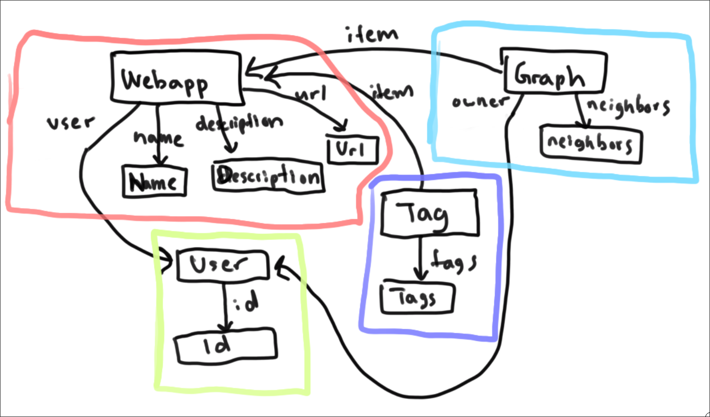

# Assignment 4 - Backend Design and Implementation

## Concepts and Data Models

The concepts changed greatly from what I expected from the end of A3. Thanks the feedback I received on the previous assignment as well as troubles and solutions I ran into while developing A4, the direction that I took Webber in changed enough to warrant an update to the concept. There were also several clarifying concepts during lecture and on discourse that greatly helped increase my understanding of concepts. Below are the updated concepts. I have not included the ones that were already provided by the skeleton as they provided what I needed and more. I will also only include the concepts that went through major changes. One important difference from the previous phase was that I have moved my `Upposting` concept into `Posting`, as I realized it didn't contribute anything significant while overcomplicating the structure of the concepts. Please check out the previous version of the concepts here: [Assignment 3](https://dismint.github.io/portfolio-jchoi/assignments/assignment3.html)

:::tip Webapping
**Purpose**: Store metadata about websites and apps that the user visits such as the name and purpose.

**Principle**: When a user wants to add a website or app, they can do so by creating a new Webapp instance

**State**:
```typescript
webapps: set Webapp
user: Webapp -> ObjectId
name: Webapp -> String
description: Webapp -> String
url: Webapp -> String
```

**Actions**:
```typescript
async create(user: ObjectId, name: string, description: string, url: string) {
    const _id = await this.webapps.createOne({ user, name, description, url });
    return { msg: "Webapp created successfully!", _id };
}

async delete(_id: ObjectId) {
    await this.webapps.deleteOne({ _id });
    return { msg: "Webapp deleted successfully!" };
}

async setName(_id: ObjectId, name: string) {
    await this.webapps.partialUpdateOne({ _id }, { name });
    return { msg: "Webapp name updated!" };
}

async setDescription(_id: ObjectId, description: string) {
    await this.webapps.partialUpdateOne({ _id }, { description });
    return { msg: "Webapp description updated!" };
}

async setUrl(_id: ObjectId, url: string) {
    await this.webapps.partialUpdateOne({ _id }, { url });
    return { msg: "Webapp URL updated!" };
}

async getByUser(user: ObjectId) {
    return await this.webapps.readMany({ user });
}

async getById(user: ObjectId) {
    return await this.webapps.readOne({ _id: user });
}

async getOwner(_id: ObjectId) {
    const webapp = await this.webapps.readOne({ _id });
    return webapp?.user.toString();
}
```
:::

:::tip Graphing [Item]
**Purpose**: Represent the connections of items to each other

**Principle**: When a user wants to connect an Item to already existing items, they can do so by adding it to the graph. The graph allows users to model and visualize the relationships between items

**State**:
```typescript
graphs: set Graph
item: Graph -> ObjectId
owner: Graph -> ObjectId
neighbors: Graph -> set ObjectId
```

**Actions**: 
```typescript
async addNode(item: ObjectId, owner: ObjectId) {
    await this.tags.createOne({ item, owner, neighbors: [] });
    return { msg: "Node successfully created!" };
}

async addEdge(from: ObjectId, to: ObjectId) {
    await this.tags.collection.updateOne({ item: from }, { $addToSet: { neighbors: to } });
    await this.tags.collection.updateOne({ item: to }, { $addToSet: { neighbors: from } });
    return { msg: "Edge successfully created!" };
}

async deleteNode(item: ObjectId) {
    await this.tags.deleteOne({ item });
    return { msg: "Node successfully deleted!" };
}

async deleteEdge(from: ObjectId, to: ObjectId) {
    await this.tags.collection.updateOne({ item: from }, { $pull: { neighbors: to } });
    await this.tags.collection.updateOne({ item: to }, { $pull: { neighbors: from } });
    return { msg: "Edge successfully deleted!" };
}

async updateEdgesForUserNode(user: ObjectId, item: ObjectId, connected: string[]) {
    const nodes = await this.tags.readMany({ owner: user });
    for (const node of nodes) {
      if (node.item.toString() !== item.toString()) {
        if (connected.includes(node.item.toString())) {
          await this.addEdge(item, node.item);
          await this.addEdge(node.item, item);
        } else {
          await this.deleteEdge(item, node.item);
          await this.deleteEdge(node.item, item);
        }
      }
    }
    return { msg: "Edges updated for user node!" };
}

async getUserNodes(user: ObjectId) {
    return await this.tags.readMany({ owner: user });
}
```
:::

:::tip Tagging [Item]
**Purpose**: Label and add metadata about items

**Principle**: When users want to convey additional information about a item, they can do so by adding tags to the item. Tags can be used to sort, filter, and search for items

**State**:
```typescript
items: set Item
item: Item -> ObjectId
tags: Item -> set String
```

**Actions**:
```typescript
private async create(item: ObjectId, tags: string[]) {
    const _id = await this.tags.createOne({ item, tags });
    return { msg: "Tags created successfully!", _id };
}

private async ensureCreated(item: ObjectId) {
    if (!(await this.tags.readOne({ item }))) {
      await this.create(item, []);
    }
}

private async delete(item: ObjectId) {
    await this.ensureCreated(item);
    await this.tags.deleteOne({ item });
}

async addTags(item: ObjectId, tags: string[]) {
    await this.ensureCreated(item);
    await this.tags.collection.updateOne({ item }, { $addToSet: { tags: { $each: tags } } });
    return { msg: "Tags successfully updated!" };
}

async deleteTags(item: ObjectId, tags: string[]) {
    await this.ensureCreated(item);
    for (const tag of tags) {
      if (!(await this.tags.readOne({ item }))?.tags.includes(tag)) {
        throw new DoesNotExistError(`Tag ${tag} does not exist for item ${item}`);
      }
    }
await this.tags.collection.updateOne({ item }, { $pull: { tags: { $in: tags } } });
    if ((await this.tags.readOne({ item }))?.tags.length === 0) {
      this.delete(item);
    }
    return { msg: "Tags deleted successfully!" };
}

async getMatchingItems(item: ObjectId, others: ObjectId[]) {
    await this.ensureCreated(item);
    const tags = await this.tags.readOne({ item });
    if (!tags) {
      return [];
    }
    const items = await this.tags.readMany({ item: { $in: others } });
    return items.filter((other) => other.tags.some((tag) => tags.tags.includes(tag)));
}

async getItemsWithTag(items: ObjectId[], targetTag: string) {
    console.log(items, targetTag);
    const tags = await this.tags.readMany({ item: { $in: items } });
    return tags.filter((tag) => tag.tags.includes(targetTag));
}

async topTagsForItems(items: ObjectId[], limit: number) {
    const tags = await this.tags.readMany({ item: { $in: items } });
    const tagCounts = tags.reduce(
      (acc, tag) => {
        for (const t of tag.tags) {
          acc[t] = (acc[t] || 0) + 1;
        }
        return acc;
      },
      {} as Record<string, number>,
    );
    return Object.entries(tagCounts)
      .sort((a, b) => b[1] - a[1])
      .slice(0, limit)
      .map(([tag, count]) => ({ tag, count }));
}

async getTagsForId(item: ObjectId) {
    await this.ensureCreated(item);
    const tags = await this.tags.readOne({ item });
    return tags?.tags ?? [];
}
```
:::


## App and Synchronizations

Below are the updated synchronizations for A4. One of the biggest changes I made was taking my previous definitions and simplifying them down so that most of the logic went to the concepts and were not inlined into the synchronizations. This made the synchronizations much easier to read and understand. I also added a few more synchronizations to better reflect the functionality of the app.

```typescript
app Webber:
    include Webapping
    include Graphing[Webapp]
    include Usering[Graphing]
    include Tagging[Webapp]
    include Upposting[Graph]
    include Sessioning[User]

  @Router.get("/status")
  async getStatus() {
    return { msg: "Server is running! " };
  }

  /**
   * Create New Webapp
   * @param session: User Session
   * @param name: Webapp Name
   * @param description: Webapp Description
   * @param url: Webapp URL
   * @returns: Webapp Object
   **/
  @Router.put("/webapp")
  async addWebapp(session: SessionDoc, name: string, description: string, url: string) {
    const user = Sessioning.getUser(session);
    const webappResult = await Webapping.create(user, name, description, url);
    await Graphing.addNode(webappResult._id, user);
    Posting.create(user, `Created webapp ${webappResult._id}`);
    return webappResult;
  }

  /**
   * View All Webapps
   * @param session: User Session
   * @returns: Array of Webapp Objects
   **/
  @Router.get("/webapp/view/all")
  async viewAllWebapps(session: SessionDoc) {
    const user = Sessioning.getUser(session);
    return await Webapping.getByUser(user);
  }

  /**
   * View One Webapp
   * @param session: User Session
   * @param _id: Webapp ID
   * @returns: Webapp Object
   **/
  @Router.get("/webapp/view")
  async viewWebapp(session: SessionDoc, _id: string) {
    const user = Sessioning.getUser(session);
    return await Webapping.getById(new ObjectId(_id));
  }

  /**
   * Delete a Webapp
   * @param session: User Session
   * @param _id: Webapp ID
   * @returns: Success Message
   **/
  @Router.delete("/webapp")
  async deleteWebapp(session: SessionDoc, _id: string) {
    const user = Sessioning.getUser(session);
    if ((await Webapping.getOwner(new ObjectId(_id))) !== user.toString()) {
      throw new WrongUserError("You do not own this webapp!");
    }

    const webappResult = await Webapping.delete(new ObjectId(_id));
    await Graphing.deleteNode(new ObjectId(_id));
    Posting.create(user, `Deleted webapp ${_id}`);
    return webappResult;
  }

  /**
   * Update a Webapp
   * @param session: User Session
   * @param _id: Webapp ID
   * @param name: New Webapp Name (optional)
   * @param description: New Webapp Description (optional)
   * @param url: New Webapp URL (optional)
   * @returns: Success Message
   **/
  @Router.patch("/webapp")
  async patchWebapp(session: SessionDoc, _id: string, name?: string, description?: string, url?: string) {
    const user = Sessioning.getUser(session);
    if ((await Webapping.getOwner(new ObjectId(_id))) !== user.toString()) {
      throw new WrongUserError("You do not own this webapp!");
    }
    if (name) {
      await Webapping.setName(new ObjectId(_id), name);
    }
    if (description) {
      await Webapping.setDescription(new ObjectId(_id), description);
    }
    if (url) {
      await Webapping.setUrl(new ObjectId(_id), url);
    }
    Posting.create(user, `Updated webapp ${_id}`);
    return { msg: "Webapp updated!" };
  }

  /**
   * Add Tags to Webapp
   * @param session: User Session
   * @param _id: Webapp ID
   * @param tags: Comma-separated list of tags
   * @returns: Success Message
   **/
  @Router.post("/tag/add")
  async addTagsToWebapp(session: SessionDoc, _id: string, tags: string) {
    const user = Sessioning.getUser(session);
    if ((await Webapping.getOwner(new ObjectId(_id))) !== user.toString()) {
      throw new WrongUserError("You do not own this webapp!");
    }
    const tagResult = await Tagging.addTags(new ObjectId(_id), tags.split(","));
    const neighbors = await Webapping.getByUser(user);
    const matching = await Tagging.getMatchingItems(
      new ObjectId(_id),
      neighbors.map((w) => w._id),
    );
    await Graphing.updateEdgesForUserNode(
      user,
      new ObjectId(_id),
      matching.map((w) => w.item.toString()),
    );
    Posting.create(user, `Added tags ${tags} to webapp ${_id}`);
    return tagResult;
  }

  /**
   * Remove Tags from Webapp
   * @param session: User Session
   * @param _id: Webapp ID
   * @param tags: Comma-separated list of tags
   * @returns: Success Message
   **/
  @Router.post("/tag/remove")
  async deleteTagsFromWebapp(session: SessionDoc, _id: string, tags: string) {
    const user = Sessioning.getUser(session);
    if ((await Webapping.getOwner(new ObjectId(_id))) !== user.toString()) {
      throw new WrongUserError("You do not own this webapp!");
    }
    const tagResult = await Tagging.deleteTags(new ObjectId(_id), tags.split(","));
    const neighbors = await Webapping.getByUser(user);
    const matching = await Tagging.getMatchingItems(
      new ObjectId(_id),
      neighbors.map((w) => w._id),
    );
    await Graphing.updateEdgesForUserNode(
      user,
      new ObjectId(_id),
      matching.map((w) => w.item.toString()),
    );
    Posting.create(user, `Removed tags ${tags} from webapp ${_id}`);
    return tagResult;
  }

  /**
   * View Tags for Webapp
   * @param session: User Session
   * @param _id: Webapp ID
   * @returns: Array of Tags
   **/
  @Router.get("/tag/view")
  async viewTagsForWebapp(session: SessionDoc, _id: string) {
    const user = Sessioning.getUser(session);
    return Tagging.getTagsForId(new ObjectId(_id));
  }

  /**
   * View Webapps Filtered by Tag for User
   * @param session: User Session
   * @param tag: Tag to filter by
   * @returns: Array of Webapp Objects
   **/
  @Router.get("/tag/filter")
  async filterWebappsByTag(session: SessionDoc, tag: string) {
    const user = Sessioning.getUser(session);
    const webapps = await Webapping.getByUser(user);
    const filtered = await Tagging.getItemsWithTag(
      webapps.map((w) => w._id),
      tag,
    );
    return filtered;
  }

  /**
   * Top Tags for User
   * @param session: User Session
   * @param limit: Number of tags to return
   * @returns: Array of Tags
   **/
  @Router.get("/user/top/tags")
  async userTopTags(session: SessionDoc, limit: number) {
    const user = Sessioning.getUser(session);
    const webapps = await Webapping.getByUser(user);
    return await Tagging.topTagsForItems(
      webapps.map((w) => w._id),
      limit,
    );
  }

  /**
   * Get Nodes That Belong to User
   * @param session: User Session
   * @returns: Array of Graph Nodes
   **/
  @Router.get("/graph/nodes")
  async getGraphNodes(session: SessionDoc) {
    const user = Sessioning.getUser(session);
    return await Graphing.getUserNodes(user);
  }
```

There are small changes that I have made here and there to better suit the idea of concepts that were taught in class. For example, I have changed the mental model to be from pieces of data mapping ownership, to a concept containing a set that contains, as a field, an owner or ownee if one exists. I will update for the final once feedback for the midpoint and A3 is given. Overall the changes are quite nice as I have become more comfortable with the concept model.

## Data Model Diagram



## Deployment

The Vercel instance was successfully deployed and is running. The link is here: [Vercel Instance](https://a4-rouge.vercel.app/)

The bottom of the tester shows the functions that I have implemented. The backend can be seen at this Github link: [Backend](https://github.com/dismint/a4)

## Reflection 

There were an incredible amount of changes that happened for various reasons from the last assignment to this one. One of the large changes was a change in understanding of concepts and how they came together to make the overall application. Before, I would make modular components that would be owned or parented by some other concept. For example, when I had my original Webapps concept, it was the case that each user would take in Webapps as an Item dependency, and the User concept has a notion of owning certain items. I realized this is not the correct way to modularize things, and instead each concept should try its best to be self-contained and manage all the information that is contained within it.

There were also many learnings once I started implementing the assignment. Most likely the biggest learning and the largest tradeoff was deciding where to put the control flow. There was a minor amount of control flow in the synchronizations to make it not as messy in the concepts, but for the most part, it was a much better move to keep the synchronizations clean and have the concepts do the heavy listing. Concepts are powerful, but because of their design you often don't get to leverage the full power of programming paradigms in a regular way, meaning I had to think a lot about how to split up designs that I had been doing a particular way in previous coding. For example, the graphs that I had as well as processing on the graph nodes were much different than a regular graph as the work did not happen in one place. Rather I had to offload some work to Tagging, some to Webapping, and then synchronize them together to get the same functionality I was used to. This led to something that felt akin to factoring in math, where I split something into smaller, modular parts.
