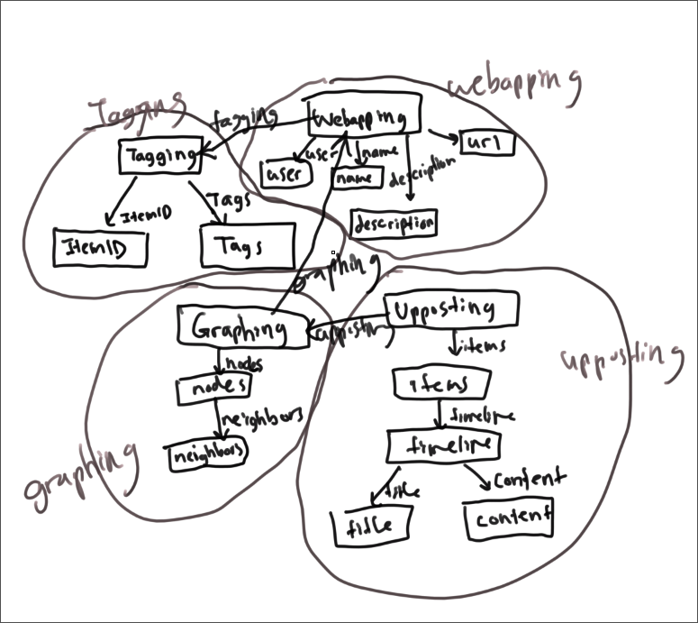

# Midpoint Check In

## Concepts and Data Models

For the vast majority, the concepts have remained the same from A3. Please check out the previous form here: [Assignment 3](https://dismint.github.io/portfolio-jchoi/assignments/assignment3.html)

There are small changes that I have made here and there to better suit the idea of concepts that were taught in class. For example, I have changed the mental model to be from pieces of data mapping ownership, to a concept containing a set that contains, as a field, an owner or ownee if one exists. I will update for the final once feedback for the midpoint and A3 is given. Overall the changes are quite nice as I have become more comfortable with the concept model.

Here is the model that I have created as a graphic for this midpoint so far:

## Deployment

The Vercel instance was successfully deployed and is running. The link is here: [Vercel Instance](https://a4-rouge.vercel.app/)

The bottom of the tester shows the functions that I have implemented. The backend can be seen at this Github link: [Backend](https://github.com/dismint/a4)

The two concepts that I chose to implement were the `Tagging` and `Webapping` concepts, which actually allowed me to create REST routes for a large number of synchronizations. My app has the interesting property that even with a subset of concepts, I can get basic functionality. However, many of the actual REST routes I have implemented has additional logic in the synchronization that is not there because the other concepts are not present. Thus I have used the two concepts I wrote as well as the given concepts to create as fully functional an app as possible.

The repo additionally contains much of the scaffolding for the other REST routes that I could not implement due to the lack of concepts.
