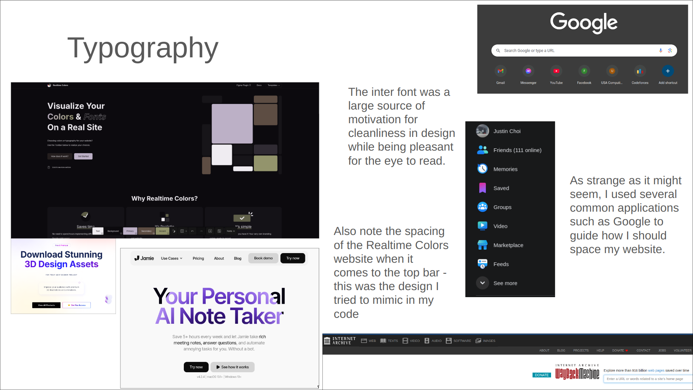
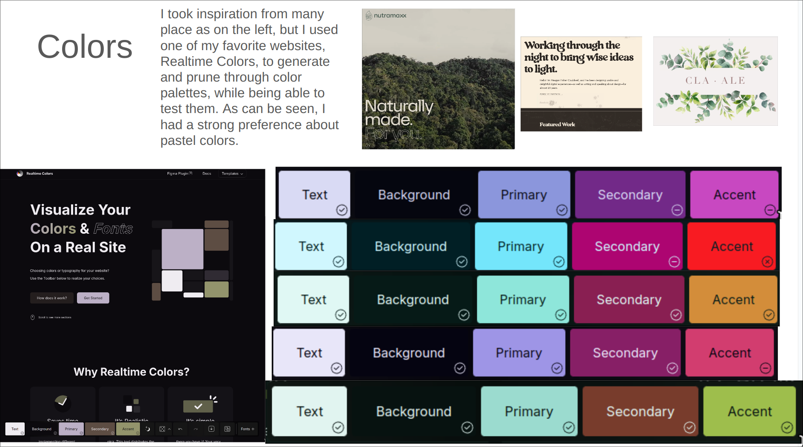

# Assignment 5 - Frontend Design

## Heuristic Evaluation

### Usability - Discoverability

- One thing that I thought about constantly when it came to my application is how to make it visually appealing while friendly to the user. Just like in the starter template for this assignment, I could have made it so the top bar is simple. The logo on the left and some other options on the right. I personally think that this is very unappealing, so moving forward I will have to balance what it means for my application to be user-friendly and visually appealing at the same time.

- I also thought about how to make the application more discoverable. I think that the search bar is a great way to do this. I could have made it so that the search bar is more prominent on the page. I could have also made it so that the search bar is more interactive. For example, when the user clicks on the search bar, it could expand and show more options. This would make it so that the user can see more options and discover more things about the application. My current option is a simple textarea that does not dynamically change, but think is something that can easily be flexed around should I need to change this aspect of my design.

### Usability - Safety

- My system is not safe at all - I realized that it is extremely easy for the user to click things once or twice more than they want, resulting in something being deleted or an extra action being performed that they did not desire in the original action. For example, adding or deleting anything in Webber doesn't have a confirm button, you simply press the action and it happens. I will most likely be keeping this as I want this assignment to be a simple framework without assuming I'm developing for a larger audience. However, I will keep this in mind for future projects.

### Physical - Fitt's Law

- This is a heuristic that I think I did very well in, at least in the wireframes. All of my important buttons for an action are right next to each other, such as delete or add buttons, and in general, when there are multiple fields to fill out, they occur in a line and they are easy to click through or mouse through from top to bottom. The user bar is also fixed at the top of the screen, so the user is always moving to the same place every single time they want to perform a menu action.

- One way that Webber slightly defies this heuristic is that the Webber graph of nodes is not the prettiest, in that the node you want to click on might be very far zoomed out or distant from your cursor, or simply might not be in scope for you to click on if you are sufficiently zoomed out. This means that you need to perform a specific set of actions to click on a given node which could be very uncomfortable. However, I think this is a good design choice for my application, and it facilitates discovery.

### Physical - Mapping

- This was a very interesting thing to think about. I believe for the vast majority, Webber did not live by these principles. There are some simple examples by which it abides, the menu bar, for example is where users would expect it to be and does what the users would expect.

- However when it comes to interacting with the graph, the icons to add and remove a node are on the bottom left and right of the graph, meaning that it is extremely difficult for a new user to discover these features without looking and thinking. This does not mean that the discoverability is necessarily bad, but it does mean that the user might be confused about why things were placed in that way.

- The above point actually reminded me about our discussion in class about scheduling applications and the random sliders that would sometimes be very hard to tell what the purpose was for. Perhaps if that was also mapped in a better way, the user would have an easier time telling what was going on.

### Linguistic - Speak a User's Language

- One thing that I really liked when I opened the starter template was that the toasts were very easy for the user to tell what was going on. I don't have any of this in my wireframe, and in fact most actions have no feedback at all. This is something that I will have to add in the future, as it is very important for the user to know what is going on when they perform an action.

- It is not the case that the user is exposed to any developer information, but it will definitely be useful to keep in mind that the user does not have the knowledge of a developer, and thus information that is communicated to them should remain as simple as possible

### Linguistic - Consistency

- I think that Webber is very consistent in its design. The user bar is always at the top, the graph is always in the middle, and the menu is always on the left. This is something that I will definitely keep in mind when I am designing my application. I think that this is a very important heuristic to follow, as it makes the user feel comfortable and know where to go when they want to perform an action.

- One thing that I think I could have done better is the consistency of the buttons. I think that the buttons are very consistent in their design, but I think that the buttons could have been more consistent in their placement. For example, the delete button is on the right side of the screen, but the add button is on the left side of the screen. 

- In terms of other applications, I think it is a good idea to constantly remind myself that this should be a usable application, and although I might want to add fancy bells and whistles, I should always try to base the design off of existing applications to make sure that there is nothing extremely unfamiliar to the user.

## Frontend

[Code Repository](https://github.com/dismint/a5)

[Code Deployment](https://a5-chi.vercel.app/)

## Visual Study

### Typeography

### Colors

